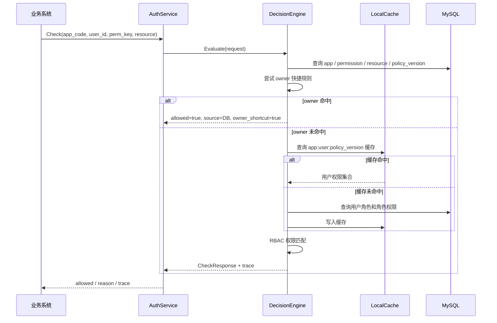
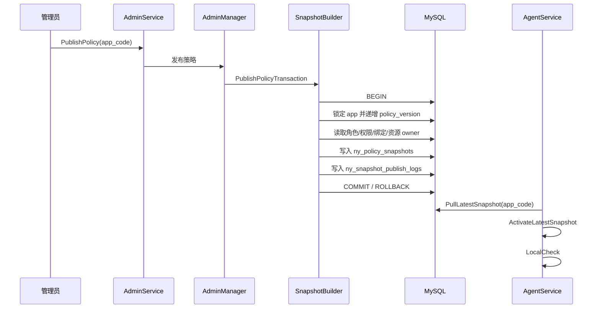

# ny_auth

> 一个基于 **C++17 + brpc + Protobuf + MySQL** 实现的轻量级权限鉴权服务。
> 支持中心化 RBAC 判权、资源 owner 快捷规则、策略版本管理、策略快照发布，以及 Agent / Sidecar 本地快照判权。

`ny_auth` 适合用来学习和实践“权限中台”的核心设计：业务系统不再把权限逻辑散落在各个服务内部，而是把角色、权限、资源归属、策略发布和判权解释统一交给独立的鉴权服务管理。

项目内置 `doc_center` 文档协作平台测试数据，可以完整演示从“配置权限策略”到“在线鉴权”，再到“发布快照并本地判权”的完整链路。

------

## 项目定位

在业务系统中，权限通常会随着业务增长变得越来越复杂：

- 谁能访问某个资源？
- 用户拥有多个角色时如何合并权限？
- 资源 owner 是否可以绕过普通 RBAC？
- 策略变更后如何让缓存自动失效？
- 为什么某次请求被拒绝？
- Sidecar / Agent 如何在本地完成低延迟判权？

`ny_auth` 试图用一个相对清晰的后端模型解决这些问题。

它的核心目标是：

> 为多个业务系统提供统一的权限策略管理、中心化鉴权、决策解释、策略发布和本地快照判权能力。

典型应用场景：

- 文档系统：文档查看、编辑、发布、删除权限控制
- 后台管理系统：不同管理员角色拥有不同操作权限
- SaaS 多租户系统：不同应用接入同一套鉴权服务
- 微服务架构：业务服务通过 RPC / HTTP 调用统一鉴权
- Sidecar 模式：业务服务旁路部署本地 Agent，降低鉴权延迟

------

## 核心能力

### 1. 中心化鉴权

通过 `AuthService.Check` 判断某个用户是否拥有某个权限。

一次判权请求通常包含：

```json
{
  "app_code": "doc_center",
  "user_id": "u1001",
  "perm_key": "document:edit",
  "resource_type": "document",
  "resource_id": "doc_001",
  "request_id": "req_001"
}
```

服务会综合判断：

- 应用是否存在并启用
- 权限是否存在并启用
- 资源是否存在并启用
- 用户是否是资源 owner
- 用户是否拥有能够覆盖目标权限的角色
- 当前策略版本是多少
- 本次决策来自 DB 还是缓存

------

### 2. RBAC 权限模型

项目实现了基础 RBAC 模型：

```text
User -> Role -> Permission
```

也就是：

- 用户可以拥有多个角色
- 角色可以绑定多个权限
- 判权时合并用户所有角色的权限集合
- 用户拥有目标权限则放行，否则拒绝

示例：

```text
u1001 -> editor -> document:read / document:edit / document:publish
u1002 -> viewer -> document:read
u9000 -> admin  -> document:read / document:edit / document:publish / document:delete / admin:grant_role
```

------

### 3. 资源 owner 快捷规则

除了普通 RBAC，`ny_auth` 还支持资源 owner 快捷规则。

例如：

```text
resource_id = doc_001
owner_user_id = u1001
perm_key = document:edit
owner_shortcut_enabled = true
```

当 `u1001` 编辑自己的 `doc_001` 时，即使没有通过普通角色权限命中，也可以因为 owner 规则直接放行。

注意：owner 快捷规则不是全局放行，它必须满足：

1. 请求中传入了 `resource_type` 和 `resource_id`
2. 资源存在且启用
3. 当前用户等于资源 owner
4. 目标权限开启了 `owner_shortcut_enabled`

这可以避免高危权限被 owner 规则误放行。例如：`document:delete`、`admin:grant_role` 一般不应开启 owner 快捷规则。

------

### 4. 策略版本与缓存自动切换

每个应用都有自己的策略版本：

```text
ny_policy_versions.current_version
```

权限缓存 key 使用：

```text
app_code:user_id:policy_version
```

当管理员发布策略后，`current_version` 会递增。新请求会自动使用新的缓存 key，从而避免粗暴清空所有缓存。

------

### 5. 决策解释与审计日志

每次鉴权会返回可解释信息：

- 是否允许
- 拒绝原因
- 命中的角色
- 命中的权限
- 是否使用 owner 快捷规则
- 当前策略版本
- 决策来源
- trace 文本

同时，系统区分两类日志：

| 日志表             | 作用                             |
| ------------------ | -------------------------------- |
| `ny_decision_logs` | 记录每次权限判断的结果和解释     |
| `ny_audit_logs`    | 记录管理员对权限策略做过什么修改 |

这让权限系统不仅能“给结果”，还能解释“为什么是这个结果”。

------

### 6. 策略快照与本地判权

策略发布后，系统可以生成一份只读策略快照，存入 `ny_policy_snapshots`。

Agent / Sidecar 可以：

1. 拉取最新快照
2. 激活快照到本地内存
3. 基于本地快照执行权限判断

这适合对延迟敏感的场景：业务服务不必每次都远程调用中心鉴权服务，而是可以通过本地 Agent 执行低延迟判权。

------

## 架构设计

> 说明：本 README 使用 GitHub 原生支持的 Mermaid 绘制架构图。
> 在 GitHub 仓库页面中，`mermaid` 代码块会自动渲染为图像；在部分 Markdown 编辑器、聊天窗口或普通文本预览中，可能只会显示为代码块。

### 判权流程



### 策略发布与快照流程



------

## 判权模型

`ny_auth` 的一次判权可以理解为：

```text
allow = owner_shortcut_match || rbac_permission_match
```

其中：

```text
owner_shortcut_match =
    resource exists
    && resource.owner_user_id == user_id
    && permission.owner_shortcut_enabled == true
rbac_permission_match =
    user has role
    && role has permission
    && permission.perm_key == request.perm_key
```

拒绝时会返回对应的 `DenyCode`，包括：

| 拒绝码                           | 含义             |
| -------------------------------- | ---------------- |
| `DENY_CODE_INVALID_ARGUMENT`     | 请求参数不合法   |
| `DENY_CODE_APP_NOT_FOUND`        | 应用不存在       |
| `DENY_CODE_APP_DISABLED`         | 应用已禁用       |
| `DENY_CODE_PERMISSION_NOT_FOUND` | 权限不存在       |
| `DENY_CODE_RESOURCE_NOT_FOUND`   | 资源不存在       |
| `DENY_CODE_USER_HAS_NO_ROLE`     | 用户没有任何角色 |
| `DENY_CODE_PERMISSION_DENIED`    | 用户无目标权限   |
| `DENY_CODE_INTERNAL_ERROR`       | 服务内部错误     |

------

## 技术栈

| 类别       | 技术                            |
| ---------- | ------------------------------- |
| 语言       | C++17                           |
| 构建       | CMake 3.10+                     |
| RPC 框架   | brpc                            |
| 协议       | Protobuf                        |
| 数据库     | MySQL 8.0                       |
| 数据库驱动 | MySQL Connector/C++             |
| 参数解析   | gflags                          |
| 缓存       | 进程内 LocalCache               |
| 其他依赖   | pthread、OpenSSL、zlib、LevelDB |

------

## 目录结构

```text
ny_auth/
├── CMakeLists.txt              # CMake 构建配置
├── compose.yaml                # 本地 MySQL 开发环境
├── .env.example                # Docker Compose 环境变量示例
├── .gitignore
├── include/                    # 业务头文件
├── proto/                      # Protobuf 协议定义
│   ├── auth.proto              # 中心化鉴权接口
│   ├── admin.proto             # 管理端接口
│   └── agent.proto             # Agent / Sidecar 接口
├── sql/
│   └── init.sql                # 数据库建表与测试数据
└── src/                         # 业务实现与生成的 protobuf C++ 文件
    ├── server_main.cpp
    ├── decision_engine.cpp
    ├── auth_service_impl.cpp
    ├── admin_manager.cpp
    ├── admin_service_impl.cpp
    ├── snapshot_builder.cpp
    ├── local_snapshot_engine.cpp
    └── agent_service_impl.cpp
```

------

## 快速开始

### 1. 克隆项目

```bash
git clone https://github.com/nianYovo/ny_auth.git
cd ny_auth
```

------

### 2. 启动 MySQL

项目提供了 `compose.yaml`，可以直接启动 MySQL 8.0：

```bash
docker compose up -d mysql
```

查看容器状态：

```bash
docker compose ps
```

验证数据库：

```bash
docker compose exec mysql mysql -uroot -p123456 -e "SHOW DATABASES;"
docker compose exec mysql mysql -uroot -p123456 ny_auth -e "SHOW TABLES;"
```

首次启动时，MySQL 会自动执行：

```text
sql/init.sql
```

该脚本会创建数据库、业务表、管理员账号和 `doc_center` 测试数据。

> 端口说明：如果没有创建 `.env` 文件，`compose.yaml` 默认将容器内 `3306` 映射到本机 `3307`。如果你执行了 `cp .env.example .env`，则端口会以 `.env` 中的 `MYSQL_PORT` 为准。

------

### 3. 安装依赖

Ubuntu / Debian 示例：

```bash
sudo apt-get update
sudo apt-get install -y \
  build-essential \
  cmake \
  pkg-config \
  protobuf-compiler \
  libprotobuf-dev \
  libssl-dev \
  zlib1g-dev \
  libleveldb-dev \
  libgflags-dev \
  default-libmysqlclient-dev
```

此外还需要安装：

- brpc
- MySQL Connector/C++

并确保以下检查通过：

```bash
pkg-config --cflags --libs brpc
```

CMake 也需要能够找到：

```text
mysql_driver.h
libmysqlcppconn
```

------

### 4. 编译项目

```bash
cmake -S . -B build
cmake --build build -j$(nproc)
```

编译完成后会生成：

```text
build/auth_server
```

------

### 5. 构建检查

```bash
cmake --build build -j$(nproc)
```

------

### 6. 启动服务

如果 Docker Compose MySQL 映射到本机 `3307`，使用：

```bash
./build/auth_server \
  --port=8001 \
  --db_host=127.0.0.1 \
  --db_port=3307 \
  --db_user=root \
  --db_password=123456 \
  --db_name=ny_auth \
  --cache_ttl=60 \
  --cache_max_entries=100000 \
  --admin_session_ttl=3600 \
  --admin_session_cache_max_entries=10000
```

如果你的 MySQL 使用本机 `3306`，则将 `--db_port` 改为 `3306`。

常用启动参数：

| 参数                         | 默认值      | 说明                              |
| ---------------------------- | ----------- | --------------------------------- |
| `--port`                     | `8001`      | brpc 服务监听端口                 |
| `--db_host`                  | `127.0.0.1` | MySQL 地址                        |
| `--db_port`                  | `3306`      | MySQL 端口                        |
| `--db_user`                  | `root`      | MySQL 用户名                      |
| `--db_password`              | `123456`    | MySQL 密码                        |
| `--db_name`                  | `ny_auth`   | MySQL 数据库                      |
| `--cache_ttl`                | `60`        | 权限缓存 TTL，单位秒              |
| `--cache_max_entries`        | `100000`    | 权限缓存最大条目数，`0` 表示不限制 |
| `--admin_session_ttl`        | `3600`      | 管理端登录态 TTL，单位秒          |
| `--admin_session_cache_max_entries` | `10000` | 管理端登录态缓存最大条目数，`0` 表示不限制 |
| `--agent_bootstrap_app_code` | 空          | 启动时自动加载指定 app 的最新快照 |

------

## 初始化数据

`sql/init.sql` 默认写入一个测试应用：

| 项           | 值                      |
| ------------ | ----------------------- |
| 应用名称     | 文档协作平台            |
| `app_code`   | `doc_center`            |
| `app_secret` | `secret_doc_center_123` |
| 管理员账号   | `admin`                 |
| 管理员密码   | `admin123`              |

测试角色：

| 角色     | 说明                 |
| -------- | -------------------- |
| `admin`  | 拥有高权限           |
| `editor` | 可读、编辑、发布文档 |
| `viewer` | 只能查看文档         |

测试用户：

| 用户    | 角色     | 说明                    |
| ------- | -------- | ----------------------- |
| `u9000` | `admin`  | 管理员用户              |
| `u1001` | `editor` | 编辑者                  |
| `u1002` | `viewer` | 只读用户                |
| `u3001` | 无       | 用于验证 owner 快捷规则 |

测试权限：

| 权限               | 资源类型   | owner 快捷规则 | 说明     |
| ------------------ | ---------- | -------------- | -------- |
| `document:read`    | `document` | 开启           | 查看文档 |
| `document:edit`    | `document` | 开启           | 编辑文档 |
| `document:publish` | `document` | 关闭           | 发布文档 |
| `document:delete`  | `document` | 关闭           | 删除文档 |
| `admin:grant_role` | `system`   | 关闭           | 授予角色 |

测试资源：

| 资源      | owner   | 说明     |
| --------- | ------- | -------- |
| `doc_001` | `u1001` | 新手指南 |
| `doc_002` | `u1002` | 产品周报 |
| `doc_003` | `u3001` | 个人草稿 |
| `doc_004` | `u1002` | 发布公告 |

------

## 核心接口示例

brpc 开启 HTTP / JSON 访问后，可以使用如下路径调用：

```text
http://127.0.0.1:8001/<package.Service>/<Method>
```

例如：

```text
http://127.0.0.1:8001/ny.auth.AuthService/Check
http://127.0.0.1:8001/ny.admin.AdminService/Login
http://127.0.0.1:8001/ny.agent.AgentService/LocalCheck
```

------

### 1. 中心化鉴权：owner 快捷规则放行

`u1001` 是 `doc_001` 的 owner，并且 `document:edit` 开启了 owner 快捷规则，因此可以编辑自己的文档。

```bash
curl -s -X POST 'http://127.0.0.1:8001/ny.auth.AuthService/Check' \
  -H 'Content-Type: application/json' \
  -d '{
    "app_code": "doc_center",
    "user_id": "u1001",
    "perm_key": "document:edit",
    "resource_type": "document",
    "resource_id": "doc_001",
    "request_id": "req_owner_edit_001"
  }'
```

预期结果：

```json
{
  "allowed": true,
  "reason": "...",
  "trace": {
    "owner_shortcut_used": true,
    "policy_version": 1
  },
  "deny_code": "DENY_CODE_OK"
}
```

------

### 2. 中心化鉴权：RBAC 放行

`u1002` 是 `viewer`，拥有 `document:read` 权限，因此可以读取文档。

```bash
curl -s -X POST 'http://127.0.0.1:8001/ny.auth.AuthService/Check' \
  -H 'Content-Type: application/json' \
  -d '{
    "app_code": "doc_center",
    "user_id": "u1002",
    "perm_key": "document:read",
    "resource_type": "document",
    "resource_id": "doc_001",
    "request_id": "req_viewer_read_001"
  }'
```

预期结果：

```json
{
  "allowed": true,
  "trace": {
    "matched_roles": ["viewer"],
    "matched_permissions": ["document:read"],
    "owner_shortcut_used": false
  },
  "deny_code": "DENY_CODE_OK"
}
```

------

### 3. 中心化鉴权：权限不足

`u1002` 是 `viewer`，没有 `document:delete` 权限，并且 `document:delete` 不允许 owner 快捷通过。

```bash
curl -s -X POST 'http://127.0.0.1:8001/ny.auth.AuthService/Check' \
  -H 'Content-Type: application/json' \
  -d '{
    "app_code": "doc_center",
    "user_id": "u1002",
    "perm_key": "document:delete",
    "resource_type": "document",
    "resource_id": "doc_002",
    "request_id": "req_viewer_delete_001"
  }'
```

预期结果：

```json
{
  "allowed": false,
  "deny_code": "DENY_CODE_PERMISSION_DENIED"
}
```

------

## 管理端接口示例

### 1. 登录

```bash
curl -s -X POST 'http://127.0.0.1:8001/ny.admin.AdminService/Login' \
  -H 'Content-Type: application/json' \
  -d '{
    "username": "admin",
    "password": "admin123"
  }'
```

登录成功后，响应中的：

```text
session.token
```

需要作为后续管理接口的 `operator_token`。

可以先保存为环境变量：

```bash
TOKEN='把 Login 返回的 session.token 放这里'
```

------

### 2. 创建角色

```bash
curl -s -X POST 'http://127.0.0.1:8001/ny.admin.AdminService/CreateRole' \
  -H 'Content-Type: application/json' \
  -d "{
    \"operator_token\": \"${TOKEN}\",
    \"app_code\": \"doc_center\",
    \"role_key\": \"reviewer\",
    \"role_name\": \"审核员\",
    \"description\": \"可以审核文档内容\",
    \"is_default\": false
  }"
```

------

### 3. 创建权限

```bash
curl -s -X POST 'http://127.0.0.1:8001/ny.admin.AdminService/CreatePermission' \
  -H 'Content-Type: application/json' \
  -d "{
    \"operator_token\": \"${TOKEN}\",
    \"app_code\": \"doc_center\",
    \"perm_key\": \"document:review\",
    \"perm_name\": \"审核文档\",
    \"resource_type\": \"document\",
    \"owner_shortcut_enabled\": false,
    \"description\": \"允许审核文档\"
  }"
```

------

### 4. 给角色绑定权限

```bash
curl -s -X POST 'http://127.0.0.1:8001/ny.admin.AdminService/BindPermissionToRole' \
  -H 'Content-Type: application/json' \
  -d "{
    \"operator_token\": \"${TOKEN}\",
    \"app_code\": \"doc_center\",
    \"role_key\": \"reviewer\",
    \"perm_key\": \"document:review\"
  }"
```

------

### 5. 给用户授权角色

```bash
curl -s -X POST 'http://127.0.0.1:8001/ny.admin.AdminService/GrantRoleToUser' \
  -H 'Content-Type: application/json' \
  -d "{
    \"operator_token\": \"${TOKEN}\",
    \"app_code\": \"doc_center\",
    \"user_id\": \"u2001\",
    \"role_key\": \"reviewer\"
  }"
```

------

### 6. 设置资源 owner

```bash
curl -s -X POST 'http://127.0.0.1:8001/ny.admin.AdminService/SetResourceOwner' \
  -H 'Content-Type: application/json' \
  -d "{
    \"operator_token\": \"${TOKEN}\",
    \"app_code\": \"doc_center\",
    \"resource_type\": \"document\",
    \"resource_id\": \"doc_005\",
    \"owner_user_id\": \"u2001\",
    \"resource_name\": \"评审草稿\",
    \"metadata_text\": \"created by README example\"
  }"
```

------

### 7. 模拟判权

模拟接口可以在不修改正式策略的情况下验证“如果临时授予某个角色或绑定某个权限，会不会放行”。

```bash
curl -s -X POST 'http://127.0.0.1:8001/ny.admin.AdminService/SimulateCheck' \
  -H 'Content-Type: application/json' \
  -d "{
    \"operator_token\": \"${TOKEN}\",
    \"app_code\": \"doc_center\",
    \"user_id\": \"u2001\",
    \"perm_key\": \"document:review\",
    \"resource_type\": \"document\",
    \"resource_id\": \"doc_005\",
    \"simulated_grants\": [
      {
        \"user_id\": \"u2001\",
        \"role_key\": \"reviewer\"
      }
    ],
    \"request_id\": \"req_simulate_review_001\"
  }"
```

------

### 8. 查询审计日志

```bash
curl -s -X POST 'http://127.0.0.1:8001/ny.admin.AdminService/ListAuditLogs' \
  -H 'Content-Type: application/json' \
  -d "{
    \"operator_token\": \"${TOKEN}\",
    \"app_code\": \"doc_center\",
    \"action_type\": \"\",
    \"limit\": 20
  }"
```

------

## 策略发布与本地快照判权

### 1. 发布策略

当你修改了角色、权限、绑定关系或资源 owner 后，可以发布策略：

```bash
curl -s -X POST 'http://127.0.0.1:8001/ny.admin.AdminService/PublishPolicy' \
  -H 'Content-Type: application/json' \
  -d "{
    \"operator_token\": \"${TOKEN}\",
    \"app_code\": \"doc_center\",
    \"publish_note\": \"manual publish from README\"
  }"
```

成功后会：

1. 递增 `ny_policy_versions.current_version`
2. 构建当前应用的策略快照
3. 写入 `ny_policy_snapshots`
4. 写入 `ny_snapshot_publish_logs`

------

### 2. 拉取最新快照

```bash
curl -s -X POST 'http://127.0.0.1:8001/ny.agent.AgentService/PullLatestSnapshot' \
  -H 'Content-Type: application/json' \
  -d '{
    "app_code": "doc_center"
  }'
```

------

### 3. 激活最新快照

```bash
curl -s -X POST 'http://127.0.0.1:8001/ny.agent.AgentService/ActivateLatestSnapshot' \
  -H 'Content-Type: application/json' \
  -d '{
    "app_code": "doc_center"
  }'
```

------

### 4. 查看本地快照状态

```bash
curl -s -X POST 'http://127.0.0.1:8001/ny.agent.AgentService/GetLocalSnapshotStatus' \
  -H 'Content-Type: application/json' \
  -d '{}'
```

------

### 5. 基于本地快照判权

```bash
curl -s -X POST 'http://127.0.0.1:8001/ny.agent.AgentService/LocalCheck' \
  -H 'Content-Type: application/json' \
  -d '{
    "app_code": "doc_center",
    "user_id": "u1001",
    "perm_key": "document:edit",
    "resource_type": "document",
    "resource_id": "doc_001",
    "request_id": "req_local_owner_edit_001"
  }'
```

本地判权响应会额外返回：

- 当前快照 ID
- 当前策略版本
- 本地判权来源文本

------

## 数据库设计

### 基础策略表

| 表名                  | 说明               |
| --------------------- | ------------------ |
| `ny_apps`             | 接入应用           |
| `ny_policy_versions`  | 应用当前策略版本   |
| `ny_roles`            | 角色               |
| `ny_permissions`      | 权限               |
| `ny_role_permissions` | 角色-权限绑定      |
| `ny_user_roles`       | 用户-角色绑定      |
| `ny_resources`        | 资源 owner 数据    |
| `ny_decision_logs`    | 每次鉴权的决策日志 |

### 管理端与快照表

| 表名                       | 说明             |
| -------------------------- | ---------------- |
| `ny_console_users`         | 管理员账号       |
| `ny_audit_logs`            | 管理操作审计日志 |
| `ny_policy_snapshots`      | 策略快照         |
| `ny_snapshot_publish_logs` | 快照发布日志     |

------

## Protobuf 服务定义

### AuthService

```proto
service AuthService {
  rpc Check(CheckRequest) returns (CheckResponse);
}
```

### AdminService

```proto
service AdminService {
  rpc Login(LoginRequest) returns (LoginResponse);
  rpc CreateRole(CreateRoleRequest) returns (CreateRoleResponse);
  rpc CreatePermission(CreatePermissionRequest) returns (CreatePermissionResponse);
  rpc BindPermissionToRole(BindPermissionToRoleRequest) returns (BindPermissionToRoleResponse);
  rpc GrantRoleToUser(GrantRoleToUserRequest) returns (GrantRoleToUserResponse);
  rpc SetResourceOwner(SetResourceOwnerRequest) returns (SetResourceOwnerResponse);
  rpc PublishPolicy(PublishPolicyRequest) returns (PublishPolicyResponse);
  rpc SimulateCheck(SimulateCheckRequest) returns (SimulateCheckResponse);
  rpc ListAuditLogs(ListAuditLogsRequest) returns (ListAuditLogsResponse);
}
```

### AgentService

```proto
service AgentService {
  rpc PullLatestSnapshot(PullLatestSnapshotRequest) returns (PullLatestSnapshotResponse);
  rpc PullSnapshotByVersion(PullSnapshotByVersionRequest) returns (PullSnapshotByVersionResponse);
  rpc ActivateLatestSnapshot(ActivateLatestSnapshotRequest) returns (ActivateLatestSnapshotResponse);
  rpc ActivateSnapshotByVersion(ActivateSnapshotByVersionRequest) returns (ActivateSnapshotByVersionResponse);
  rpc GetLocalSnapshotStatus(GetLocalSnapshotStatusRequest) returns (GetLocalSnapshotStatusResponse);
  rpc LocalCheck(LocalCheckRequest) returns (LocalCheckResponse);
}
```

------

## 开发指南

### 重新生成 Protobuf 代码

修改 `proto/*.proto` 后执行：

```bash
protoc -I=proto --cpp_out=src proto/auth.proto
protoc -I=proto --cpp_out=src proto/admin.proto
protoc -I=proto --cpp_out=src proto/agent.proto
```

然后重新构建：

```bash
cmake --build build -j$(nproc)
```

------

### 本地重新初始化数据库

如果修改了 `sql/init.sql`，希望重新初始化本地数据库：

```bash
docker compose down -v
docker compose up -d mysql
```

注意：

```text
docker compose down -v
```

会删除本地 MySQL 数据卷，只建议在开发和测试环境使用。

------

### 提交前检查

建议提交前执行：

```bash
docker compose config --quiet
cmake --build build -j$(nproc)
```

------

## 常见问题

### 1. 服务启动时报数据库连接失败

先确认 MySQL 容器是否健康：

```bash
docker compose ps
```

再确认服务启动参数中的端口是否和 Docker Compose 映射一致。

如果没有 `.env` 文件，通常使用：

```bash
--db_port=3307
```

如果你复制了 `.env.example`，并且其中配置：

```text
MYSQL_PORT=3306
```

则服务启动时应使用：

```bash
--db_port=3306
```

------

### 2. `mysqlcppconn not found`

说明 CMake 没有找到 MySQL Connector/C++。

请确认：

- 已安装 MySQL Connector/C++
- 系统能找到 `mysql_driver.h`
- 系统能找到 `libmysqlcppconn`

------

### 3. `pkg-config` 找不到 brpc

请确认 brpc 已正确安装，并且下面命令有输出：

```bash
pkg-config --cflags --libs brpc
```

如果没有输出，需要检查 brpc 的安装路径和 `PKG_CONFIG_PATH`。

------

### 4. 修改权限后为什么没有立刻看到新策略版本？

角色、权限、绑定关系或资源 owner 修改后，需要调用：

```text
AdminService.PublishPolicy
```

发布策略后，`current_version` 才会递增，新的快照也会生成。

------

### 5. 本地判权提示没有可用快照

需要先执行：

```text
AgentService.ActivateLatestSnapshot
```

或者：

```text
AgentService.ActivateSnapshotByVersion
```

激活成功后再调用 `LocalCheck`。

------

## 安全说明

当前项目默认数据中包含开发用管理员账号：

```text
username = admin
password = admin123
```

初始化 SQL 中的 `password_hash` 字段使用 `pbkdf2_sha256$iterations$salt$hash` 格式。该默认账号只适合本地开发和功能演示，不应直接用于生产环境。

生产环境建议至少完成以下改造：

- 使用 Argon2id / bcrypt 等更强密码哈希方案，或按生产标准提高 PBKDF2 参数
- 移除默认管理员账号，或首次启动强制修改密码
- 数据库存储 token hash，而不是明文 token
- 增加登录失败次数限制
- 增加登出和会话续期能力
- 管理接口增加更细粒度的管理端 RBAC
- 决策日志覆盖所有返回路径

------

## Roadmap

| 阶段   | 目标                                                     |
| ------ | -------------------------------------------------------- |
| `v0.1` | 完成基础鉴权闭环，让系统能够跑通核心功能                 |
| `v0.2` | 补齐工程化能力，例如 Dockerfile、CI、测试                |
| `v0.3` | 增强安全性和一致性，例如 token hash、登录限制、发布状态机 |
| `v0.4` | 产品化能力，例如 Web 控制台、监控指标、API 文档          |

### v0.1：基础鉴权闭环

-  中心化鉴权 `AuthService.Check`
-  RBAC 模型
-  owner 快捷规则
-  策略版本号
-  判权 trace
-  管理端登录
-  角色、权限、授权、资源 owner 管理
-  策略发布
-  策略快照
-  Agent 本地快照判权

### v0.2：工程化增强

-  Dockerfile 一键构建服务镜像
-  Docker Compose 同时启动 MySQL 和 ny_auth 服务
-  GitHub Actions CI
-  更完整的单元测试
-  MySQL 集成测试
-  E2E 测试脚本
-  clang-format / clang-tidy

### v0.3：安全增强

-  更强密码哈希参数或 Argon2id / bcrypt
-  token hash 存储
-  登录失败限制
-  管理端细粒度 RBAC
-  快照发布状态机

### v0.4：产品化能力

-  Web 管理控制台
-  OpenAPI / API 文档
-  Prometheus metrics
-  `/healthz` 和 `/readyz`
-  决策日志分页查询
-  SDK 示例
-  多应用接入示例

------

## 作者

- GitHub: [@nianYovo](https://github.com/nianYovo)

如果这个项目对你有帮助，欢迎 Star、Issue 或提交 PR。
